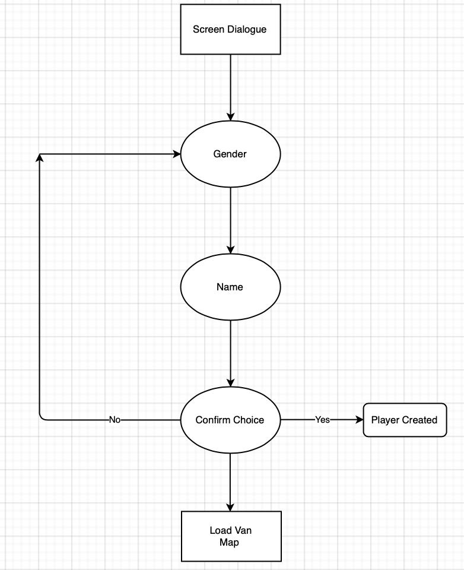
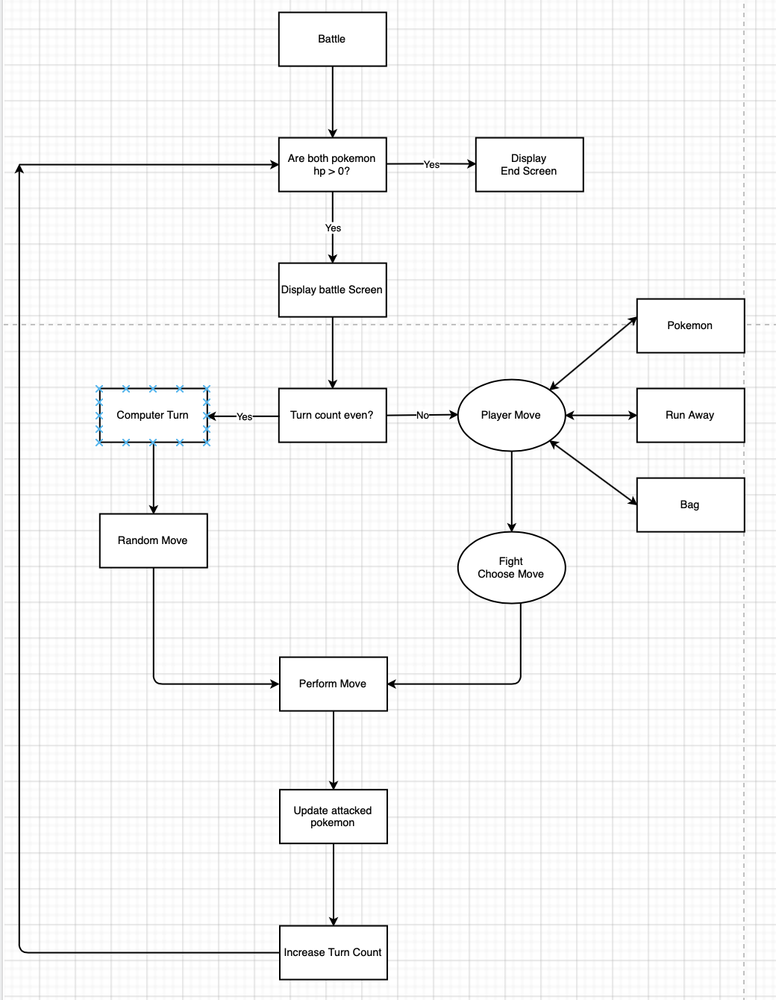
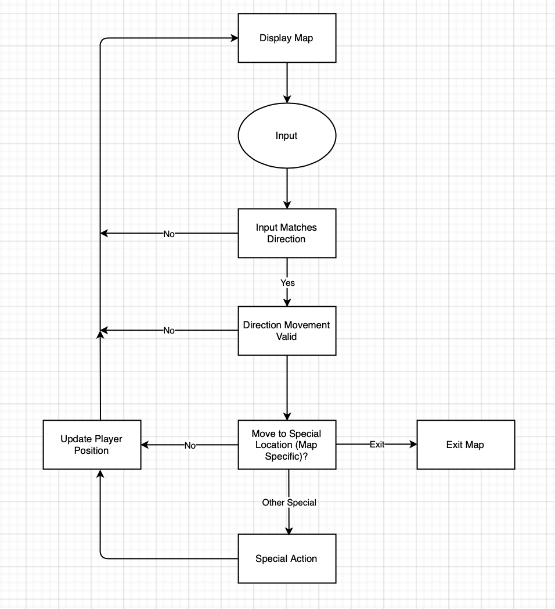

# Purpose and Scope

The purpose of this application was to recreate Pokemon Ruby in Ruby. In doing so, there would be a variety of things to choose from to recreate including:

- Character Creation
- Maps
- Pokemon selection
- Pokemon encounters
- Battle System
- Saving
- Time, Date, Playtime Tracking
- Dynamic Characters based on player gender
- Gym system
- Trainer battles

After thinking it over, the idea was to start the game and implement as many features as possible as needed. This had the benefit of ensuring a smooth player experience instead of trying to force the player to do things in a random, un-storylike order based on what features were implemented.

The main problem that this application solves is player's boredom. It is designed to recreate a popular game, Pokemon Ruby so that players could experience the game in the terminal. 

Accordingly, the target audience is people that are bored. In particular, people that have played the game during their childhood, that are in 20-30 years of age.

The application is designed to be used through the use of keyboard movements.

- A = Left
- w = Up
- S = Down
- D = Right
- Any key = prompt

As with the original Pokemon Ruby, whenever text is typed to the screen the game waits for user acknowledgement before outputting more. At this stage, any key will satisfy this requirement.

# Features

The three featured features of this applcation are:

1. Player Creation and Name Retention
1. Battle System
1. Map Creation and Player Movement

### Player Creation and Name Retention

At the beginning of the game, the player to choose their gender and their name. The name is only allowed to be comprised of letters and the (.)(,) symbols and will error check to ensure this. After naming, the player is asked to confirm their choice and loops back to gender selection unless a 'YES' is selected.

Several times throughout the game, when addressed by different characters this player name variable is displayed back to the user.

/image

Additionally, the gender of PROF. BIRCH's child will is conditional upon the player's gender. They will be the opposite of whatever gender the player is and this shows through: 

- Their mother will refer to them as son/daughter
- Their map icon will be a boy or girl
- Their name will be Terry or May

/image

### Battle System

The battle system comprises of a loop of status checking and turn taking. Turns can only take place if the status check returns that both pokemon still have a health above zero, otherwise it will exit the battle loop. 

The battle screen displays both pokemon's names, levels and a sliding health bar indicating their current health percentage.

/screenshot

There is a turn tracker to alternate between the AI and player's turns. During the player's turn, they can choose between attacking, running away, bag and swapping out pokemon. 

Damage is calculated based on the move chosen's base modifier, the attacker's attack and the defender's defense. The 'leer' and 'growl' moves don't actually do damage but work to reduce the opposing pokemon's defense and attack, respectively.

/screenshot of damage

### Map Creation and Player Movement

The map creation and movement is broken down into two parts. The first part is the creation of an overall map class that has loops over three functions: getting user input, using input to move and drawing the map.

This occurs by checking the desired movement spot - if a player is allowed to move there (for example, can't move through trees) or if a special action occurs at the place moved to (eg, exiting the map)

Every specific map is a child of this overall map class. The map is represented in a two-dimensional array.

/screen/

# Control Flow Diagram
There are three main stages of the application. These correspond to the three features. 

- Player Creation
- Map Display and Player Movement
- Battle System
  
The flow chart diagrams for each are below.

### Player Creation Flowchart

### Map Display and Player Movement Flowchart

### Battle System

# Project Management Software
This project was managed using a [trello board](https://trello.com/b/ADB6Q85d/pokemon-ruby)

# User Interaction
At the start of the application, the user is presented with some text. As in the game being emulated, at the end of each line of text, the user must interact with the application in order to advance the text. The application will accept any character being pressed as valid input for this stage.

The application guides the player through the creation of a character. First by selecting gender and then a name. Based on the selected gender, a list of prepopulated gender-specific names will appear, which the player can choose or enter their own.

If the user chooses to enter in their own name, a regex expression is used to ensure that only letters and the (.)(,) symbols are used in the creation of their name.

After selecting a name, the user is asked to confirm their selection. If the user selects no, they go back to the start of the character creation loop (which takes place in 'start.rb, lines 34-65).

Once a name is confirmed, the player's name and gender are used as arguments to create a new instance of a player class. 

The creation of a player class is important because it holds key information that is used throughout the application. Their gender is used to create the appropriate player avatar in maps and to determine the name, gender and avatar of Prof. Birch's child in game. Additionally, the player is initialized with a set of variables that each map references to load the appropriate map state when accessed.

After some more text is displayed on the screen, the game loads the 'van' map, passing the player as an argument.

Using the wasd keyboard inputs, the player can move around the map. This is acccomplished by getting printing the map to the screen, getting the desired movement input, checking if it is a valid and/or special location and then moving there. The parent Map class is responsible for dispalying the map, collecting user input, determining if a player can move there and moving the player there and then updating the screen in one big loop.

The child map classes are responsible for implementing additional movement checks before calling these super methods. For example, van.rb lines 25-32 check if the player is moving right and exiting the map before calling the Map parent method with super.

Upon exiting the van, the application loads the littleroot map. Because the player is initialized with a variable, littleroot equal to 'first' (player.rb line 20), after loading the map littleroot.rb lines 44-75 add extra figures to the map (a van) and display the player's mother moving towards them and then dialogue. By updating the map one position at a time and then printing the map, the result is what looks to be animation of the mother moving towards the player. 

These same methods are used throughout the application to create animation effects.

The player then loads their home map, while updating the player's littleroot variable to 'second'. When in the player's home, the player is instructed to go upstairs and is prevented from leaving until they do.

After they go upstairs and come back down, another animation takes place where the player watches some tv and is then instructed to go to Prof. Birch's house next door.

When exiting the house, the littleroot map is loaded. The player can revisit his home, the house next door, the top of the map or the house at the bottom of the map. The player is prevented from leaving via the top of the map with another animation but can freely enter any of the other three options.

When the player enters Prof. Birch's house, another animation takes place and they are instructed to go upstairs and visit the son/daughter (determined by being the opposite of the player's gender). Upstairs, another animation takes place. Now, the player can freely go to littleroot and exit at the top of the map, although they are warned before doing so.

When the player exits littleroot at the top, they load Route101 map and see another animation. They are then prevented from leaving the map at all and must interact with the bag. Once they have done so, they can choose a pokemon to fight with. 

This choice is important, because each pokemon has different moves available to them.

After they have chosen a pokemon, a battle takes place. The player and their opponent's pokemon names, health and levels are displayed. The player can choose from four options - attack, run, bag and pokemon. If any option other then attack is chosen, they will be informed this is not a viable choice and looped back to the options menu.

After they choose attack, depending on what pokemon they chose, the attack options will be presented. Damage is calculated behind the scenes and is only displayed to the player via the health bar and messages is extremely good or bad, such as 'that was super effective!'. Some moves will not do damage but will work behind the scenes to adjust the damage numbers for future attacks, either by increasing their own damage or decreasing the enemy's defense.

The battle will alternate between the player and the enemy AI's turn until one of them has no more health. At this stage, the game will display the appropriate message depending on whether or not the player won. At the end of the message, the game exits.

# Command Line Arguments
The available command line arguments are:

- -a
- -all
- -h 
- -help
- -v
- -version

# Help File
Installation steps
Dependencies
System/Hardware requirements
Features

# Two tests

# Installation scripts

# Ruby Gems
Four ruby gems were used in the creation of this application.

- Colorize
- TTY Prompt
- Pastel
- TTY box

